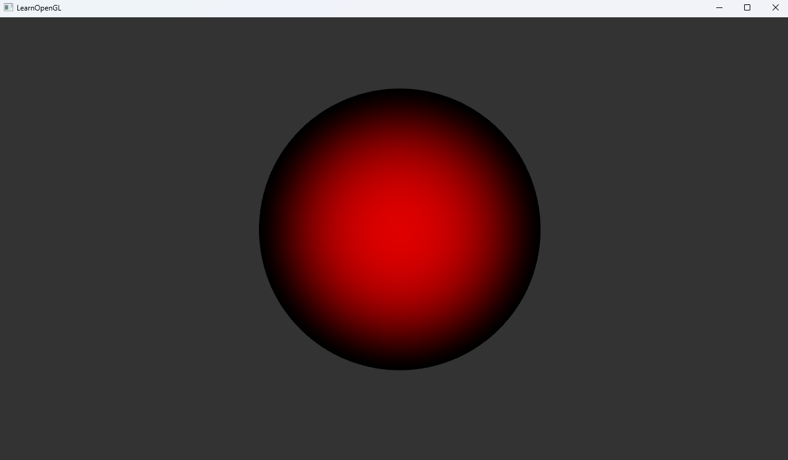

## RayCasting

This project implements **RayCasting algorithm** with OpenGL API, which refer to github project 《Study-OpenGL / a3.2.1VolumeRenderingRayCasting》.

### Environment

**Please Download C++ header files into "include" file**

```
assimp
glad
GLFW
glm
OpenGL >= 3.3
```

### Evaluation

```
make run
```

### Result




